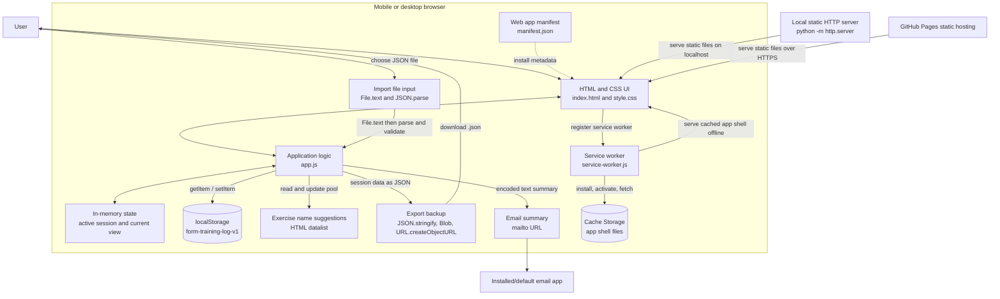

# System diagram

The app is a static, client-only web app. The browser runs the UI and owns all persistent data. There is no application server or remote database.



## Developer-facing APIs and contracts

| Concern              | Browser API or file                                                    | Current behavior                                                                                                                                                      |
| -------------------- | ---------------------------------------------------------------------- | --------------------------------------------------------------------------------------------------------------------------------------------------------------------- |
| Persistent data      | `localStorage`                                                         | Reads and writes one JSON object under `form-training-log-v1`. Shape: `{ sessions: [], names: [] }`. Storage is per browser origin.                                   |
| Exercise suggestions | `<datalist>` and the `list` input attribute                            | `data.names` is updated when an exercise is saved and used to populate suggestions.                                                                                   |
| File import          | `<input type="file">`, `File.text()`, `JSON.parse()`                   | Accepts a JSON backup with a `sessions` array. Replaces saved sessions and merges names from the backup and its exercises.                                            |
| File export          | `JSON.stringify()`, `Blob`, `URL.createObjectURL()`, anchor `download` | Downloads a dated `form-training-YYYY-MM-DD.json` backup. The export includes `format`, `version`, `sessions`, and `names`.                                           |
| QR display           | Lazy `<script>` injection, QRCode.js 1.0.0, Subresource Integrity      | Loaded only after the user taps “Show QR code.” Encodes the JSON backup locally only when it is at most 1,200 characters; larger backups are not offered as QR codes. |
| Email sharing        | `mailto:` URL and `encodeURIComponent()`                               | Builds a plain-text session summary and opens the user's configured email app. Long links are rejected; use JSON export for full backups.                             |
| SPA navigation       | `location.hash`, `hashchange`                                          | Uses `#session/<id>` for viewing a saved session; no router dependency.                                                                                               |
| Offline support      | `navigator.serviceWorker.register()` and Service Worker API            | Registers `service-worker.js` on HTTP(S), caches the app shell on install, and serves cached files when offline.                                                      |
| PWA install metadata | Web App Manifest                                                       | `manifest.json` sets the app name, start URL, standalone display, and theme colors.                                                                                   |
| Static hosting       | HTTP static file server                                                | Works at `http://localhost:8000/` and under a GitHub Pages project path because asset links and service-worker registration are relative.                             |

## Data model

```js
{
  sessions: [
    {
      id: "unique session id",
      date: "ISO-8601 timestamp",
      title: "Session title",
      startTime: "HH:mm",
      endTime: "", // empty until the session ends
      exercises: [
        {
          name: "Goblet squat",
          sets: 3,
          reps: 10,
          weight: { type: "kettlebell", kg: 16 }
        }
      ]
    }
  ],
  names: ["Goblet squat"]
}
```

Weight variants are `{ type: "body" }`, `{ type: "barbell", bar: 20, side: 10, plates: { "1.25": 0, "2.5": 1, "5": 1, "10": 0, "15": 0, "20": 0 } }`, `{ type: "dumbbell", count: 2, each: 10 }`, `{ type: "kettlebell", kg: 16 }`, or `{ type: "plates", integer: 20, fraction: 0.5 }`. Barbell plate counts describe the number of each plate per side; `side` remains as a derived compatibility value for older exports. Exercise times are not stored; `startTime` and `endTime` belong to the entire session. Totals are derived in the UI and are not persisted separately.

## Maintenance notes

- Changing the stored shape or key requires a migration or backwards-compatible read path in `read()`. Legacy barbell weights with only a per-side total are converted to the nearest representable 1.25 kg plate combination when edited.
- `localStorage` is synchronous and has limited capacity. For a much larger log, replace it with IndexedDB and keep the UI independent from storage details.
- Import currently replaces the session list. Preserve that behavior clearly or add a separate merge option if import semantics change.
- `mailto:` is intentionally a convenience summary, not a reliable backup channel; URL size limits vary by browser and email app.
- Update the service worker `CACHE` name when changing cached assets so clients can receive an updated shell.
- Service workers require a secure context. `localhost` is treated as secure by browsers, and GitHub Pages is served over HTTPS.
